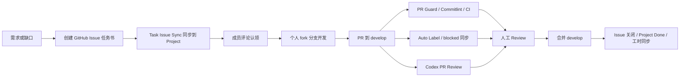

# GitHub Teamwork Template

这是一个可复用的团队协作模板仓库，用来把一个项目从“大家各做各的”带到“Issue 可派发、Project 可追踪、PR 可审查、测试有证据、文档有归属”的状态。

模板来自一个真实团队项目的协作实践，但已经抽象成通用版本。你可以把它复制到新项目，也可以直接以本仓库为模板创建团队项目。

## 这套流程解决什么

- 明确 `develop` 日常集成、`main` 发布的分支模型。
- 用 GitHub Issue 写标准任务书，避免口头任务丢失。
- 用 GitHub Project 跟踪状态、分组、优先级、模块、依赖和工时。
- 用评论命令认领任务和更新实际工时。
- 用 PR Guard、Commitlint 和 Auto Label 自动执行协作规则。
- 用 Codex PR Review 让 AI 做第一轮代码审查。
- 用测试策略和证据模板约束“测了什么、没测什么、风险是什么”。
- 用文档归属规则避免 README、服务文档和架构文档互相冲突。
- 给 AI agent 留出本地 Trellis/任务上下文边界，同时不把本地 AI 状态当成公开任务系统。

## 快速启动

1. Fork 或复制本模板到你的项目仓库。
2. 修改 [docs/collaboration/repository-setup.md](docs/collaboration/repository-setup.md) 中的仓库名、团队名、Project 名称和 label。
3. 创建 `develop` 分支并把它设为默认分支。
4. 在 GitHub 创建 Project，并添加模板要求的字段。
5. 在 GitHub 仓库设置里启用 branch protection。
6. 替换 [.github/CODEOWNERS](.github/CODEOWNERS) 中的维护者账号，并启用 Private vulnerability reporting。
7. 在 `Settings -> Secrets and variables -> Actions` 配置必要的 secrets 和 variables。
8. 按 [.github/ISSUE_TEMPLATE/task_issue.md](.github/ISSUE_TEMPLATE/task_issue.md) 创建第一批任务。
9. 成员评论 `认领：@自己的GitHub用户名` 开始任务。
10. 成员从个人 fork 分支发 PR 到 `develop`。
11. 等待 PR Guard、Commitlint、CI、可选 Codex review 和人工 review 通过。
12. 合并后关闭或自动关闭 issue，Project 状态和已记录工时同步。

## 搭配 Trellis 使用

这套模板很适合和 Trellis 一起用，但两者职责要分清：

- GitHub Issue / Project 是团队公开协作系统，负责派发任务、认领、依赖、验收、PR 关联和进度统计。
- Trellis 是本地 AI 开发系统，负责让 agent 读取规范、沉淀 PRD、记录研究和执行上下文。
- 一个公开任务可以对应一个本地 Trellis task，但公开事实仍以 GitHub Issue / Project / PR 为准。
- 发布团队任务时先创建 GitHub Issue，不要只创建 `.trellis/tasks/`。
- Agent 开始实现前，可以在本地创建或继续 Trellis task，并在 PRD 中引用 GitHub issue，例如 `Issue: #123`。
- PR 合并前，Trellis task 应完成本地验证、记录关键决策，并按团队习惯归档；PR body 仍要填写 GitHub issue、验证命令和风险。

推荐搭配流程：

1. 协调人用 GitHub Issue 模板发布任务。
2. 成员或 agent 评论 `认领：@用户名`，Project 进入 `In Progress`。
3. 本地 agent 按 Trellis 流程创建/继续 task，读取 `AGENTS.md`、`CONTRIBUTING.md` 和相关 `docs/`。
4. Trellis PRD 记录 GitHub issue、范围、验收标准和已读文档。
5. 实现、测试、文档更新都在本地完成，并把验证结果写回 PR body。
6. PR review 和 CI 通过后合并；GitHub issue / Project 完成公开收尾，Trellis task 完成本地归档。

可以把这个模板中的 [AGENTS.md](AGENTS.md) 作为 Trellis 项目的根级 agent 说明起点，再按具体项目补充 `.trellis/spec/`、`.agents/skills/` 和本地 workflow。核心原则是：Trellis 让 AI 干活更稳，GitHub 让团队协作可见。

## 推荐目录

```text
.
├── .github/
│   ├── ISSUE_TEMPLATE/
│   ├── codex/prompts/
│   ├── workflows/
│   ├── labeler.json
│   └── pull_request_template.md
├── docs/
│   ├── architecture/
│   ├── collaboration/
│   ├── testing/
│   └── templates/
├── AGENTS.md
└── CONTRIBUTING.md
```

## 必读文档

| 场景 | 先读 |
| --- | --- |
| 新人加入项目 | [CONTRIBUTING.md](CONTRIBUTING.md), [docs/README.md](docs/README.md) |
| 配置 GitHub 仓库 | [docs/collaboration/repository-setup.md](docs/collaboration/repository-setup.md) |
| 创建和认领任务 | [docs/collaboration/task-issue-project-workflow.md](docs/collaboration/task-issue-project-workflow.md) |
| 发 PR | [.github/pull_request_template.md](.github/pull_request_template.md), [CONTRIBUTING.md](CONTRIBUTING.md) |
| 配置 Codex review | [docs/collaboration/repository-setup.md](docs/collaboration/repository-setup.md#codex-pr-review) |
| 改文档 | [docs/collaboration/documentation-workflow.md](docs/collaboration/documentation-workflow.md) |
| 做测试任务 | [docs/testing/strategy.md](docs/testing/strategy.md) |
| 使用 AI agent | [AGENTS.md](AGENTS.md), [docs/collaboration/agent-workflow.md](docs/collaboration/agent-workflow.md) |

## 团队工作流总览



## 需要你按项目改掉的内容

- Project 名称，默认是 `Team Project`。
- Group 选项，默认是 `Product`、`Backend`、`Frontend`、`DevOps`、`QA`、`Special`。
- 模块 label，默认是 `area:frontend`、`area:backend`、`area:devops`、`area:testing`、`area:docs`、`ci`。
- PR 目标分支，默认是 `develop`。
- 仓库默认分支，推荐设为 `develop`。
- 是否启用 Codex review，以及对应的 OpenAI token 和可选 endpoint。
- CODEOWNERS 中的维护者账号，以及团队的私密安全联系方式。
- Dependabot 的目标分支、更新频率和受信自动化账号。
- 项目自己的 CI，例如前端、后端、部署、测试命令。

## 默认安全姿态

- 敏感 token 只放 GitHub Actions Secrets。
- 非敏感 endpoint 和开关放 GitHub Actions Variables。
- `pull_request_target` workflow 不执行 PR 分支代码。
- PR head 内容在 Codex review 中视为不可信输入。
- 自动化只根据 base 分支中的 workflow 和 prompt 运行。
- Project token 只用于 Project GraphQL，同步 issue 和评论继续使用 `GITHUB_TOKEN`。
